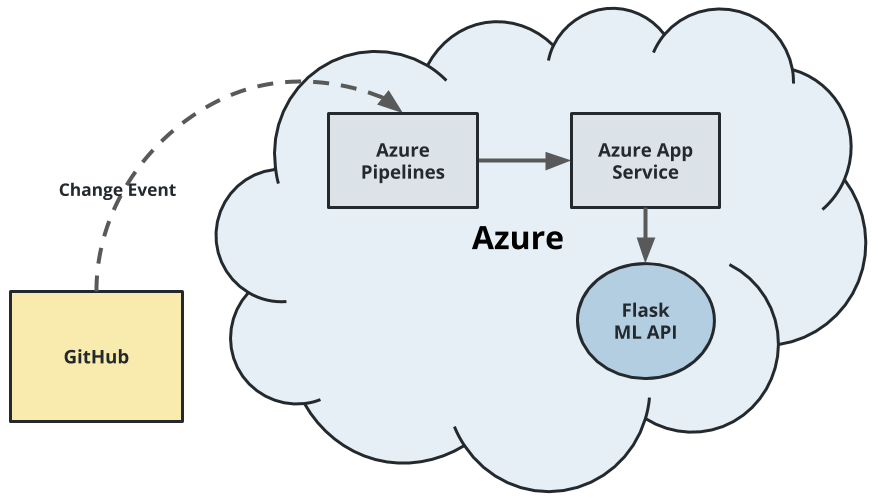
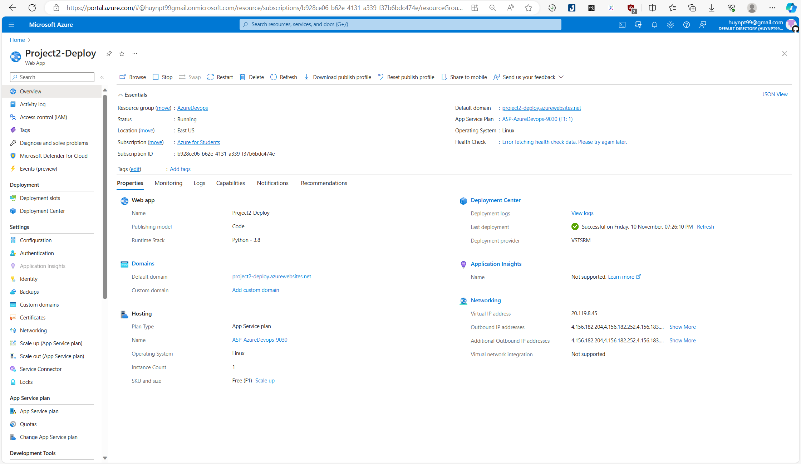
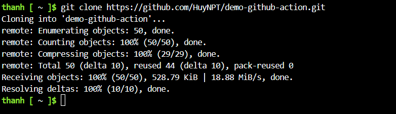
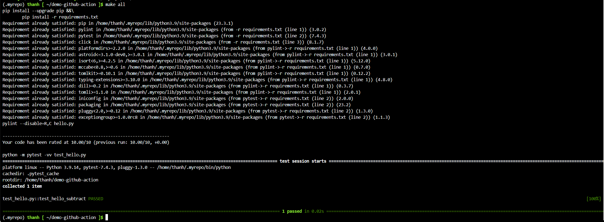
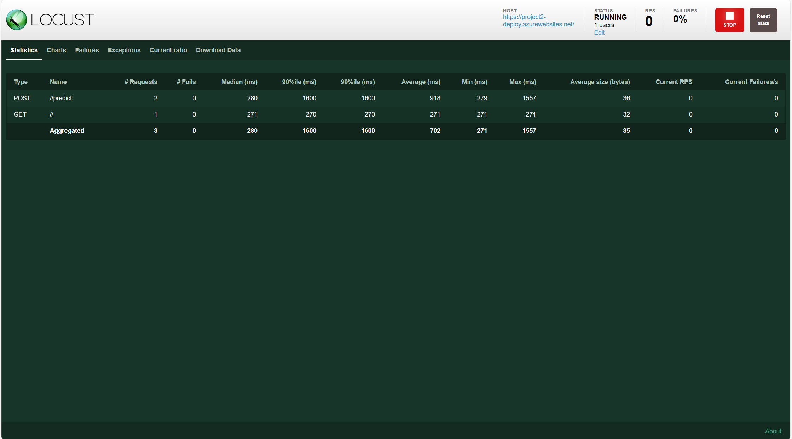
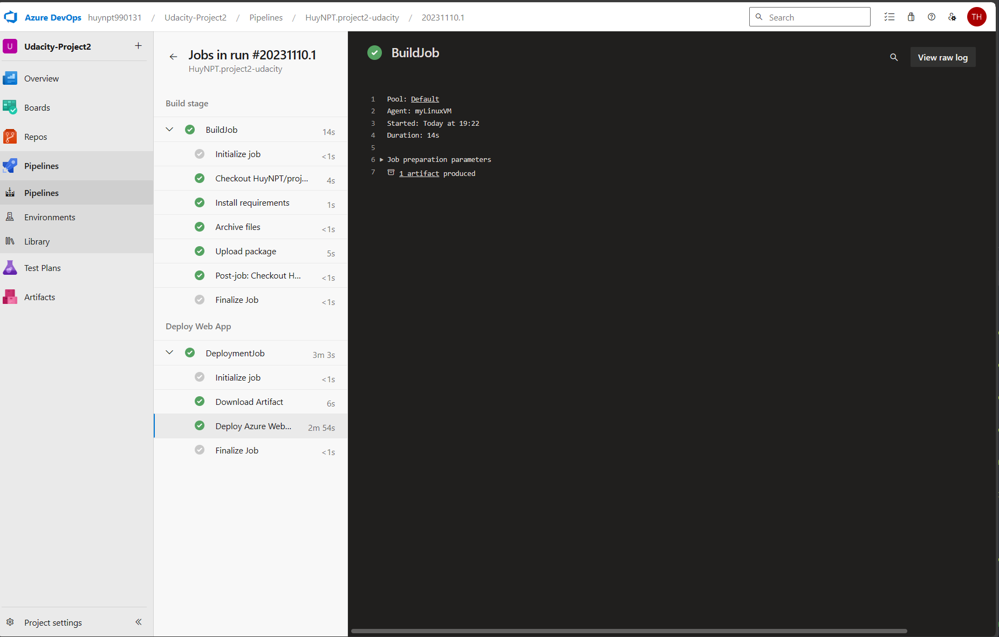
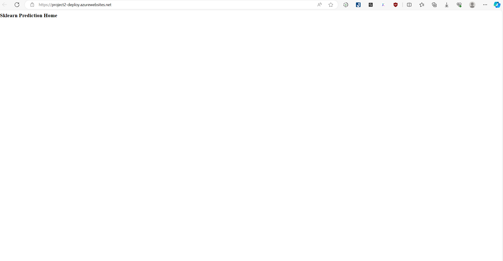
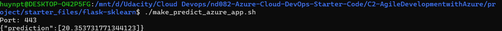
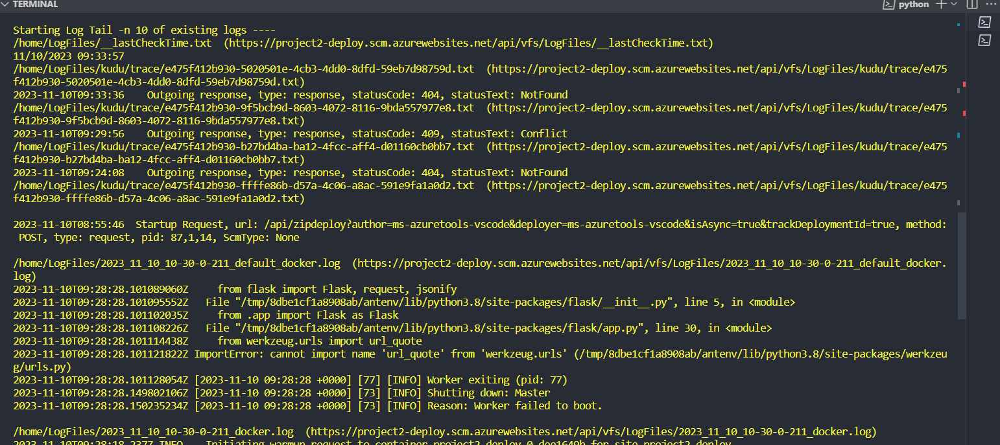

# Overview
[](https://github.com/HuyNPT/demo-github-action/actions/workflows/python-app.yml)
## Project Plan
Project Plan

* A link to a Trello board for the project
https://trello.com/invite/b/5TjuMMQU/ATTIefb7008729775633916a8f423b98e1db99EE1492/udacity-project2

* A link to a spreadsheet that includes the original and final project plan>

## Instructions

* Architectural Diagram (Shows how key parts of the system work)>


Run command to deploy app to Azure Appservice
az webapp up -n <your-appservice> -g <your-resources-group (if already exist else don't put this into your cmd)> I'm already deployed the webapp so i just need type this command az webapp up -n <your-appservice>

* Project running on Azure App Service

* Project cloned into Azure Cloud Shell

* Passing tests that are displayed after running the `make all` command from the `Makefile`

* Output of a test run

* Output Locust

* Successful deploy of the project in Azure Pipelines.  [Note the official documentation should be referred to and double checked as you setup CI/CD](https://docs.microsoft.com/en-us/azure/devops/pipelines/ecosystems/python-webapp?view=azure-devops).

* Running Azure App Service from Azure Pipelines automatic deployment

* Successful prediction from deployed flask app in Azure Cloud Shell.  [Use this file as a template for the deployed prediction](https://github.com/udacity/nd082-Azure-Cloud-DevOps-Starter-Code/blob/master/C2-AgileDevelopmentwithAzure/project/starter_files/flask-sklearn/make_predict_azure_app.sh).
The output should look similar to this:

```bash
udacity@Azure:~$ ./make_predict_azure_app.sh
Port: 443
{"prediction":[20.35373177134412]}
```

* Output of streamed log files from deployed application

> 

## Enhancements
Project can be upgraded by Azure Pipelines only when Pull Request is approved for the Main branch.
This pipeline can also be applied to Java, NodeJs, and C#.
## Demo 
https://www.youtube.com/watch?v=1RWMaXJrxKE


